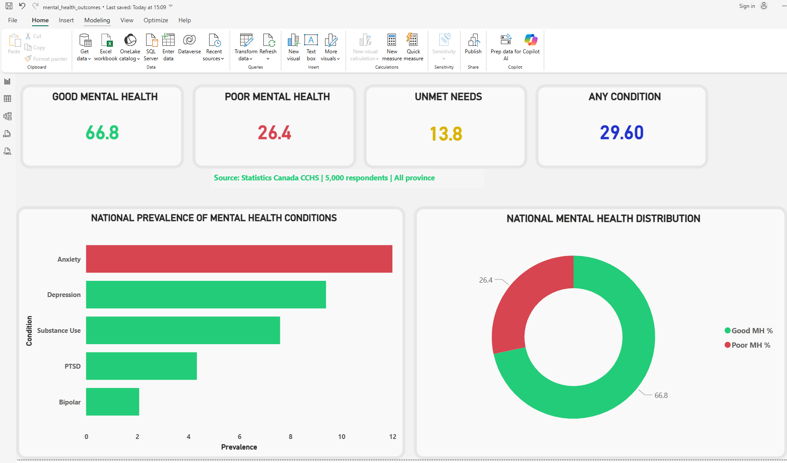
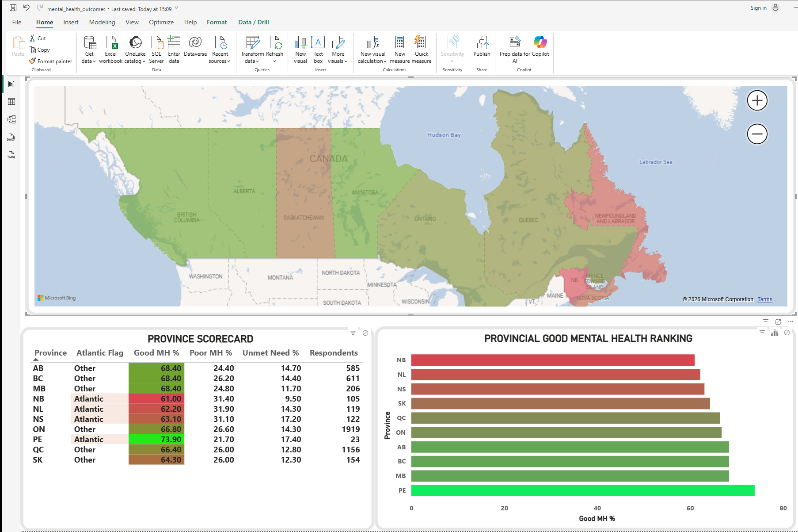
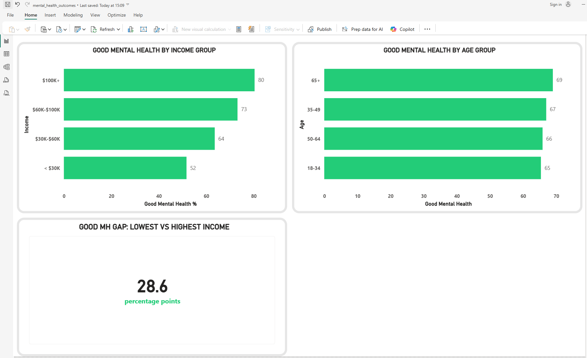
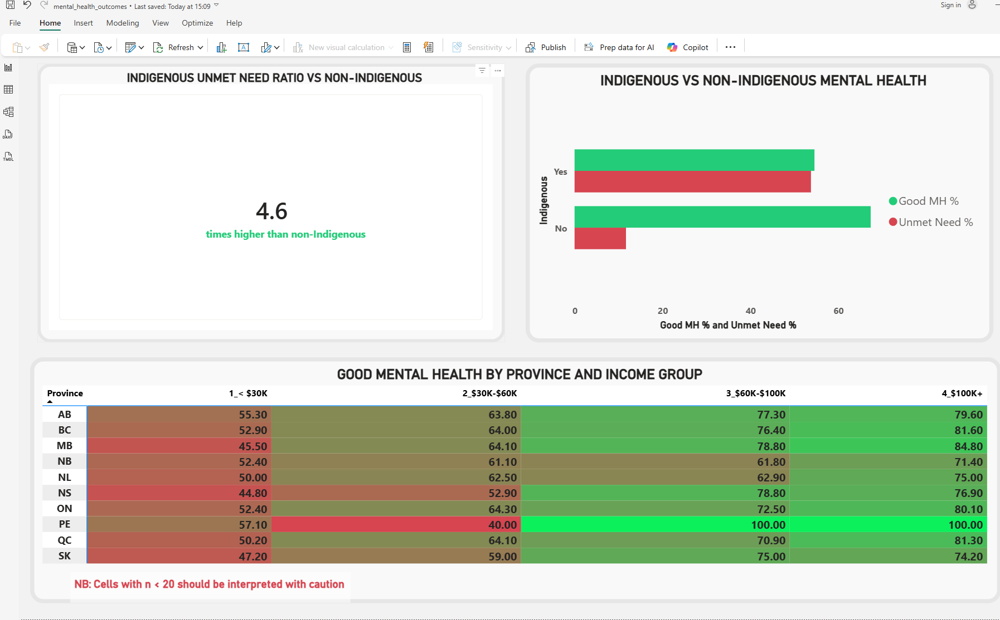

# Power BI Dashboard Spec
## Mental Health Outcomes — Canada (CCHS)

**File:** `mental_health_outcomes.pbix`
**Data connection:** `cchs_data.csv` — 5,000 respondents, 17 columns
**Load via:** Get Data → Text/CSV → select cchs_data.csv

**Column types to set after loading:**
- `respondent_id`, `mh_rating`, `good_mh`, `unmet_need`, `saw_mh_provider` → Whole Number
- `Depression`, `Anxiety`, `PTSD`, `Bipolar`, `Substance_Use`, `has_any_condition` → Whole Number
- `province`, `age_group`, `sex`, `income_group`, `education`, `indigenous` → Text

---

## Calculated Columns

Create these in Modeling → New Column:

```dax
Atlantic Flag =
IF(
    cchs_data[province] IN {"NB", "NL", "NS", "PE"},
    "Atlantic",
    "Other"
)
```

```dax
High Risk Group =
IF(
    cchs_data[income_group] = "< $30K"
    && cchs_data[education] IN {"Less than HS", "High School"},
    "High Risk",
    "Other"
)
```

```dax
Income Order =
SWITCH(cchs_data[income_group],
    "< $30K",     "1_< $30K",
    "$30K-$60K",  "2_$30K-$60K",
    "$60K-$100K", "3_$60K-$100K",
    "$100K+",     "4_$100K+"
)
```

Note: Use `Income Order` instead of `income_group` wherever income columns appear
in visuals. This forces correct ascending sort order in charts and matrices.

---

## DAX Measures

Create these measures in a dedicated `_Measures` table:

```dax
Good MH % =
ROUND(AVERAGE(cchs_data[good_mh]) * 100, 1)

Poor MH % =
ROUND(
    COUNTROWS(FILTER(cchs_data, cchs_data[mh_rating] >= 4))
    / COUNTROWS(cchs_data) * 100
, 1)

Unmet Need % =
ROUND(AVERAGE(cchs_data[unmet_need]) * 100, 1)

Any Condition % =
ROUND(AVERAGE(cchs_data[has_any_condition]) * 100, 1)

Indigenous Unmet Ratio =
VAR indig_unmet =
    CALCULATE(AVERAGE(cchs_data[unmet_need]),
              cchs_data[indigenous] = "Yes")
VAR non_unmet =
    CALCULATE(AVERAGE(cchs_data[unmet_need]),
              cchs_data[indigenous] = "No")
RETURN
DIVIDE(indig_unmet, non_unmet)

Indigenous Unmet Ratio Display =
FORMAT([Indigenous Unmet Ratio], "0.0") & "x"

Low Income Good MH % =
CALCULATE(
    AVERAGE(cchs_data[good_mh]) * 100,
    cchs_data[income_group] = "< $30K"
)

High Income Good MH % =
CALCULATE(
    AVERAGE(cchs_data[good_mh]) * 100,
    cchs_data[income_group] = "$100K+"
)

Income MH Gap =
ROUND([High Income Good MH %] - [Low Income Good MH %], 1)
```

---

## Condition Prevalence Table

Create this calculated table in Modeling → New Table.
It powers the bar chart on Page 1. Use `Income Order` instead of `income_group`
in the Columns field of any matrix visual to enforce correct sort order.

```dax
ConditionPrevalence =
UNION(
    ROW("Condition", "Anxiety",       "Prevalence", AVERAGE(cchs_data[Anxiety])*100,        "Highlight", 1),
    ROW("Condition", "Depression",    "Prevalence", AVERAGE(cchs_data[Depression])*100,     "Highlight", 0),
    ROW("Condition", "Substance Use", "Prevalence", AVERAGE(cchs_data[Substance_Use])*100,  "Highlight", 0),
    ROW("Condition", "PTSD",          "Prevalence", AVERAGE(cchs_data[PTSD])*100,           "Highlight", 0),
    ROW("Condition", "Bipolar",       "Prevalence", AVERAGE(cchs_data[Bipolar])*100,         "Highlight", 0)
)
```

Field assignments for the bar chart:
- Y-axis: `ConditionPrevalence[Condition]`
- X-axis: `ConditionPrevalence[Prevalence]`
- Legend: `ConditionPrevalence[Highlight]`
- Set Highlight=1 colour to `#E74C3C` (red — Anxiety)
- Set Highlight=0 colour to `#27AE60` (green — all others)

---

## How to Open
1. Download `mental_health_outcomes.pbix` from this repo
2. Open Power BI Desktop
3. File → Open → select the .pbix file
4. The dashboard loads with all 4 pages ready to explore

---

## Dashboard Pages

## Page 1 — National Snapshot

**Visual 1 — KPI cards (4 cards in a row)**
- Good MH %: `[Good MH %]` — green
- Poor MH %: `[Poor MH %]` — red
- Unmet Need %: `[Unmet Need %]` — amber
- Any Condition %: `[Any Condition %]` — neutral blue

**Subtitle text box below KPI row:**
`Source: Statistics Canada CCHS | 5,000 respondents | All provinces`

**Visual 2 — Horizontal bar chart: Condition prevalence**
- Y-axis: `ConditionPrevalence[Condition]`
- X-axis: `ConditionPrevalence[Prevalence]`
- Legend: `ConditionPrevalence[Highlight]`
- Sort descending by Prevalence
- Anxiety bar red, all others green (see Highlight field above)
- Title: "National Prevalence of Mental Health Conditions"

**Visual 3 — Donut: Good vs Poor MH**
- Values: `[Good MH %]`, `[Poor MH %]`
- Green (`#27AE60`) and red (`#E74C3C`) segments
- Title: "National Mental Health Distribution"

---

## Page 2 — Provincial Analysis

**Visual 1 — Filled Map**
- Location: `cchs_data[province]` — set Data category to Province/State, Country to Canada
- Color saturation: `[Good MH %]`
- Color scale: `#E74C3C` (red/low) → `#27AE60` (green/high)
- Tooltips: Province, Good MH %, Sum of unmet_need

**Visual 2 — Table: Province scorecard**
Columns: Province, Atlantic Flag, Good MH %, Poor MH %, Unmet Need %, Respondents
- Conditional formatting on Good MH %: Background colour → Gradient → red to green
- Conditional formatting on Atlantic Flag: Rules → "Atlantic" = `#FEF3CD` (amber)

**Visual 3 — Bar chart: Province ranking**
- Y-axis: `cchs_data[province]`
- X-axis: `[Good MH %]`
- Sort ascending so worst province appears at top
- Conditional formatting: red → green matching scorecard
- Title: "Provincial Good Mental Health Ranking"

---

## Page 3 — Demographic Breakdown

**Visual 1 — Clustered bar: Income gradient**
- Y-axis: `cchs_data[Income Order]`
- X-axis: `[Good MH %]`
- Columns sort ascending so < $30K is at bottom and $100K+ at top
- Data labels on
- Title: "Good Mental Health by Income Group"

**Visual 2 — Clustered bar: Age group**
- Y-axis: `cchs_data[age_group]`
- X-axis: `[Good MH %]`
- Title: "Good Mental Health by Age Group"

**Visual 3 — Card: Income gap**
- Measure: `[Income MH Gap]`
- Card title: "Good MH Gap: Lowest vs Highest Income"
- Callout value label: "percentage points"
- Expected value: 28.6

---

## Page 4 — Equity Analysis

**Visual 1 — Clustered bar: Indigenous vs non-Indigenous**
- Y-axis: `cchs_data[indigenous]`
- X-axis: add both `[Good MH %]` and `[Unmet Need %]`
- Good MH % colour: `#27AE60`, Unmet Need % colour: `#E74C3C`
- Sort so Yes (Indigenous) appears above No
- Title: "Indigenous vs Non-Indigenous Mental Health"

**Visual 2 — Card: Indigenous unmet need ratio**
- Measure: `[Indigenous Unmet Ratio Display]`
- Card title: "Indigenous Unmet Need Ratio vs Non-Indigenous"
- Callout value label: "times higher than non-Indigenous"
- Expected display: 4.6x

**Visual 3 — Matrix: Province × Income**
- Rows: `cchs_data[province]`
- Columns: `cchs_data[Income Order]`
- Values: `[Good MH %]`
- Conditional formatting on Values: Background → Gradient → red to green
- Title: "Good MH % by Province and Income Group"
- Add footnote text box: "NB: Cells with n < 20 should be interpreted with caution"

---

## Theme and Colours

| Element | Hex |
|---------|-----|
| Good MH / positive | `#27AE60` |
| Poor MH / negative | `#E74C3C` |
| Unmet need / warning | `#F39C12` |
| Atlantic highlight | `#FEF3CD` |
| Background | `#FAFAFA` |
| Card background | `#FFFFFF` |
| Grid lines | `#E8E8E8` |

---

## Known Data Notes

- PE has only 23 respondents — province-level breakdowns for PE should be
  interpreted with caution, especially when filtered by income or age group
- Indigenous respondents n=251 — sufficient for group-level analysis
- Income group strings use plain hyphens throughout (no en-dashes)
- All binary columns (good_mh, conditions, unmet_need) are 0/1 integers

---

## Dashboard Screenshots




